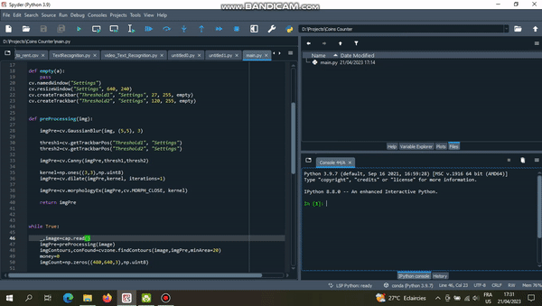

# Real-Time Coins Counter using OpenCV and cvzone

## Demo



## Overview

This project demonstrates a real-time money counting application using computer vision techniques. By analyzing object contours in a webcam feed, the script estimates the total value based on predefined area thresholds. The implementation is done in Python, utilizing the OpenCV library for image processing and the cvzone library for contour detection and visualization.

## Features

Real-time money counting through webcam feed
Object contour detection using OpenCV
Value estimation based on contour size
Adjustable image processing parameters through a graphical interface
Simple visualization of detected contours and total amount

### Requirements

- Python 3.x
- OpenCV (cv2) library
- cvzone library
- Webcam or a camera
  
### Installation

Clone this repository:

```
https://github.com/Benitmulindwa/Real-Time-Coins-counter-OpenCv.git
```

```
cd Real-Time-Coins-counter-OpenCv
```

### Install the required libraries:

```
pip install opencv-python cvzone
```
### Usage

Run the script:

```
python main.py
```

Adjust the trackbars in the **"Settings"** window to fine-tune image processing parameters.

Hold objects in front of the webcam to see the real-time money count.

Press 'q' to exit the application.

### Customization

You can customize the **hsvVals** dictionary in the script to adapt color detection for your specific scenario.

### Contributing

Contributions are welcome! If you find any issues or want to enhance the project, feel free to submit a pull request.

#### License

This project is licensed under the MIT [License](LICENSE). See the LICENSE file for details.
